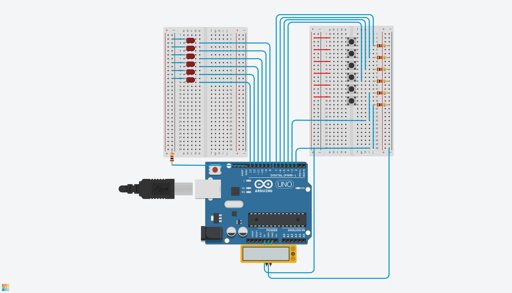
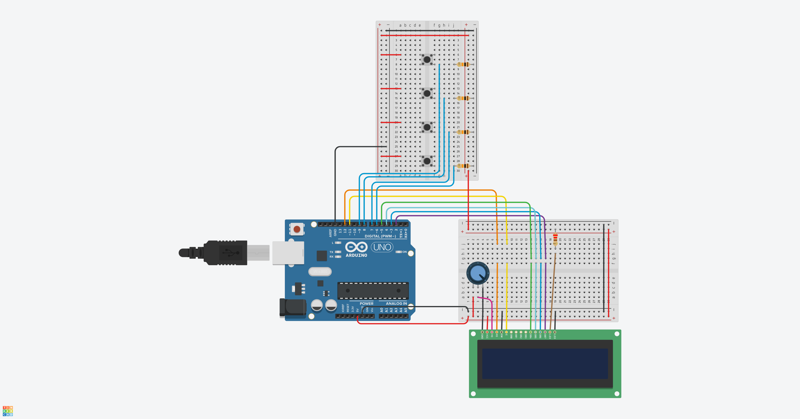

# elevator_design
Elevator Simulink and Arduino Design Assignment

### Version 1
TinkerCAD Link to Project: [Link](https://www.tinkercad.com/things/87GbKUhuq5H-start-simulating/editel?lessonid=EHD2303J3YPUS5Z&projectid=OIYJ88OJ3OPN3EA&collectionid=OIYJ88OJ3OPN3EA&sharecode=_znIEZ4fqS3IBTxoxEJg1FbaOym_PGGQc4165FV0xqE)

Features:
- LEDs associated with each floors, showing the current floor of the elevator.
- Single `push-button` on each floor to call the elevator.
- The requests are addressed efficiently such that
    - If lift is at `Stop`, nearest request is set as the target.
    - If lift is going in a certain direction, the requests in the direction are given priority.
    - If lift started from 2nd floor and is currently at 3rd floor going to the 5th floor as target, and a new request comes from 4th floor during this process, it is accepted, and the lift stops at 4th floor. However, if the request was from 1st floor, it is added to the request queue, and addressed after all the requests in the current direction are completed.

### Version 2
TinkerCAD Link to Project: [Link](https://www.tinkercad.com/things/jj3Lm2bG7UU-copy-of-arduino-with-lcd-i2c/editel?sharecode=EChcfPEz8YvTkz7lKekh3VUClFr80gPaPcH6cSwwOi0)

Features:
- LCD Pannel displaying [Current Floor, State of Elevator, Target Floor].

